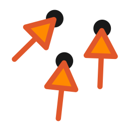
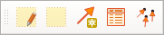
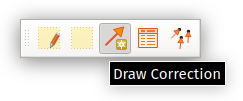
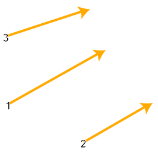
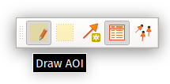
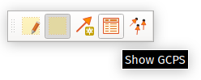
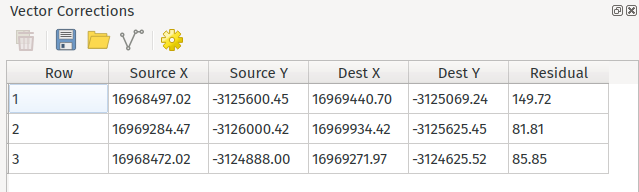

# QGIS Vector Correction Plugin - Documentation

## Introduction

The Vector Correction plugin allows users to warp and correct vector layers through the creation of correction
vectors which specify how different parts of the vector layer should be deformed.

The plugin offers a range of techniques for warping layers, including

- Linear
- Projective
- Helmert
- Thin Plate Splines
- Polynomial (Orders 1-3)

The plugin is created by [North Road Consulting](http://north-road.com) on behalf of Natural Resources Canada.

## Workflow

The plugin is designed around a specific workflow for correcting vector layers against a reference basemap.
All plugin actions are controlled through the Vector Correction Toolbar, which will be shown as soon as the
plugin is installed:

### Project Setup

First, a QGIS project containing the reference layers to correct against must be created.

The layers to correct should then be added to the project, and each made editable via the standard
QGIS *Toggle Editing* action:
  

**Important: Whenever a correction is applied it will warp *all* layers which are marked as editable, not just the active layer!**

### Digitize Correction Vectors

Users should then draw one or more *correction vectors* by clicking the "Draw Corrections" tool in the plugin
toolbar:

Correction vectors are created by clicking first on the origin point with the left mouse button, and then clicking on
the destination point with the left mouse button. Correction vectors are shown with a numbered arrow symbol
on the map:

**Note: The Draw Corrections tool respects any snapping configuration currently defined for the project, so
you can snap precisely to existing features if desired!**

In order to make it easier to precisely position the destination point a semi-transparent overlay showing
features from the target layers will follow the mouse cursor as the user draws correction vectors.

### Area of Interest

An *Area of Interest* (AOI) must also be defined by clicking the AOI tool and then clicking and dragging
to draw a rectangular area over the map.

This area defines the region which will be impacted by the vector correction.

**Only *vertices* from features which fall within the AOI will be corrected, and any features or vertices which sit outside
the AOI will be left untouched by the correction.** This ensures that features retain their topological
relationships after corrections are applied.

### Apply Corrections

After the correction vectors have been drawn and the AOI set, the user can click the "Apply Correction" button
to calculate and apply the correction to all editable layers:

The correction will be applied to the layers, but stored only in the edit buffer for the layers so
can be freely undone/redone as desired. It is necessary to click the standard QGIS "Save Edits" button in order to make the changes permanent and update the
underlying data source.
  
## Correction Table

By clicking the "Show GCPs" button a Correction Table dock window will be opened, summarizing all digitized
correction vectors will be shown:

This table includes:

- A row number, which is also shown next to all vector correction lines on the map
- The source X and Y coordinate
- The destination X and Y coordinate
- The residual for each correction. This will be shown as soon as a sufficient number of correction vectors have been drawn and
  it is possible to calculate the transformation required.

  
Rows can be removed from the table by selecting them and then clicking the "Delete Selected Rows" button.

Additionally, the toolbar contains controls for exporting and importing the vector corrections, or saving
them to a standard line layer (e.g. as a Shapefile or GeoPackage).

## Plugin Options

From the Correction Table dock clicking the Settings button will open the plugin settings. Options include:

- Transformation method: specifies which mathematical method to use to calculate the transformation. Different
  methods will achieve different corrections, so experiment with the available options to determine which
  works best in different situations.
- The line symbol to use to show the correction vector arrows on the map.
- The fill symbol to use for showing the area of interest on the map.

  

  